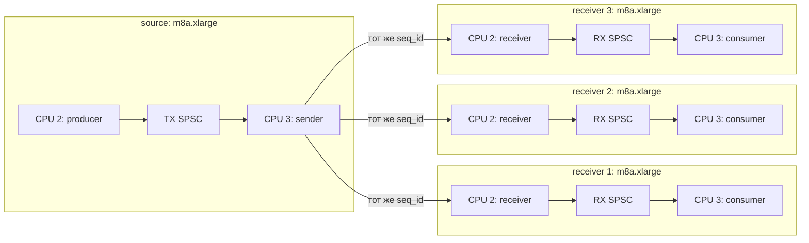

# AWS runner: устройство стенда и сборки

> Команды для проверяющего и точные параметры сдаваемого запуска находятся в
> [`reproduction.md`](reproduction.md). Этот документ объясняет архитектуру
> автоматизации и границы ответственности её компонентов.

## 1. Топология

В наших измерениях стенд был развёрнут в `us-east-1` и состоял из пяти EC2:

- один узел-источник `m8a.xlarge` с `producer` и `sender`;
- три отдельных узла-получателя `m8a.xlarge`, на каждом своя пара `receiver` и
  `consumer`;
- временный NAT `t4g.nano` для подготовки приватных узлов и управления через
  SSM.

Четыре измерительных узла находятся в одной AZ и приватной подсети. Дочерняя
placement group со стратегией `cluster` находится внутри родительской
`precision-time`: первая задаёт близкое сетевое размещение, вторая даёт доступ к
точному источнику времени ENA PHC.

На каждом измерительном узле два приватных ENI:

- управляющий `control ENI` остаётся у Linux для SSM, S3 и синхронизации часов;
- измерительный `data ENI` передаётся DPDK через `igb_uio`.

Узлы не имеют публичных IPv4 и входящих портов управления. Во время измерения
интерактивные SSM-сессии и загрузки завершаются, чтобы управляющий трафик не
добавлял нагрузку.



Один `sender` рассылает каждое событие с одинаковыми `seq_id` и `send_ts_ns`
всем активным адресатам. У каждого получателя независимы входная очередь, учёт
доставки и файл результатов.

## 2. CPU, ядро и часы

У `m8a.xlarge` четыре vCPU, соответствующие четырём физическим ядрам без SMT.
На всех измерительных узлах применяется одинаковая раскладка:

| CPU | Источник | Получатель | Режим |
|---:|---|---|---|
| `0-1` | ОС, SSM, ENA IRQ | ОС, SSM, ENA IRQ | системные задачи |
| `2` | `producer` | `receiver` | изолирован, процесс закреплён |
| `3` | `sender` | `consumer` | изолирован, процесс закреплён |

Параметры ядра:

```text
nohz_full=2-3
rcu_nocbs=2-3
irqaffinity=0-1
isolcpus=domain,managed_irq,2-3
```

Перед нагрузкой проверяются `/proc/cmdline`, affinity процессов,
`/proc/interrupts`, governor/frequency и отсутствие посторонней нагрузки на CPU
`2-3`.

Основная односторонняя задержка равна `receive_ts - send_ts` на системных часах,
синхронизированных `chrony` от ENA PHC. Поправка равна нулю; рядом с каждым
запуском сохраняется граница ошибки часов до и после нагрузки.

Опциональная двусторонняя UDP-проба проходит через control ENI и служит
диагностикой сдвига и асимметрии этого пути. Её результат хранится отдельно от
основной задержки DPDK через data ENI.

## 3. Каноническая сборка

Релизный `.deb` всегда собирается в закреплённом контейнере Ubuntu 24.04:

```text
Docker Ubuntu 24.04
  -> Clang 22 + libc++: sender, receiver, clock_probe
  -> GCC Ubuntu 24.04: producer, consumer
  -> DPDK 25.11.3: только net/ena и testpmd
  -> модульные тесты и проверка установки
  -> nFPM
  -> spectral-task_<version>+<fingerprints>_amd64.deb
```

Основная команда:

```bash
make deb
```

Пакет содержит:

```text
/usr/libexec/spectral-task/bin/{producer,sender,receiver,consumer,clock_probe}
/usr/libexec/spectral-task/bin/dpdk-testpmd
/usr/libexec/spectral-task/lib/{libc++,libc++abi,libunwind}.so.1
/usr/libexec/spectral-task/dpdk-25.11.3/
/usr/share/doc/spectral-task/third-party/
```

RUNPATH измеряемых бинарников указывает на DPDK 25.11.3 и libc++ внутри пакета.
Metadata `.deb` также требует системные Ubuntu-пакеты `dpdk`, `librte-*`,
`libc6`, `libgcc-s1` и `libstdc++6`. Системный DPDK предоставляет DKMS-модуль
`igb_uio` и диагностические утилиты; измеряемый ENA PMD загружается из каталога
пакета.

Сборка приложения выполняется на рабочей станции. На EC2 устанавливаются
`chrony`, закреплённое AWS-ядро, системные DPDK/DKMS-пакеты и инструменты для
сборки официального ENA 2.17.2 через DKMS.

## 4. Доставка и готовность узла

Многофазная подготовка выполняется так:

1. Make собирает `.deb`, Terraform загружает пакет и SHA-256 в приватный S3.
2. EC2 создаются с аварийным Scheduler и локальными bootstrap-таймерами.
3. После регистрации в SSM выполняются `phc-prepare.sh`, `dpdk-prepare.sh` и
   `runner-bootstrap.sh` в этом порядке.
4. Узлы загружаются на ядре `6.17.0-1020-aws`; проверяются ENA PHC/chrony,
   изоляция CPU, hugepages и привязка data ENI.
5. Пара `testpmd → testpmd` подтверждает связь через измерительные ENI.
6. На всех получателях запускаются `receiver` и `consumer`. Источник стартует
   после явного READY каждого получателя.
7. SSM Agent сохраняет логи и сжатые CSV в `results/*` приватного bucket, а
   оркестратор скачивает их в `artifacts/aws-runner/<run-id>/`.

Повтор команды `make aws-cluster-up` продолжает незавершённую фазу из локального
Terraform state. Прямой одиночный `terraform apply` не реализует этот протокол
готовности.

## 5. Жизненный цикл и расходы

Полный стенд использует 18 Standard On-Demand vCPU:

```text
4 * m8a.xlarge (4 vCPU) + 1 * t4g.nano (2 vCPU) = 18 vCPU
```

Один абсолютный `expires_at` управляет EventBridge Scheduler и локальными
systemd-таймерами на всех пяти EC2. До регистрации в SSM каждый узел защищён
отдельным bootstrap-таймером. Продление TTL считается завершённым после
успешной команды SSM на всех пяти узлах.

`make aws-cluster-stop` останавливает compute и сохраняет 104 GiB gp3, S3 и
Terraform state. После `start` EC2 могут получить другое физическое размещение,
поэтому одна сравнительная серия выполняется без stop между её плечами.

Перед `make aws-cluster-down` результаты скачиваются локально. Команда удаляет
EC2, EBS, bucket, Scheduler, SSM Associations, placement groups и runner IAM
roles, после чего проверяет отсутствие этих ресурсов.

Создание новых `m8a.xlarge` зависит и от квоты vCPU, и от свободной мощности в
выбранной AZ. `Server.InsufficientInstanceCapacity` означает, что создание можно
повторить позже либо начать новую измерительную эпоху в другой совместимой AZ.

## 6. Границы автоматизации

Terraform владеет сетью, IAM, S3, EC2, Scheduler, SSM Associations и общим TTL.
AWS CLI внутри оркестратора запускает процессы через SSM, ожидает готовность и
скачивает результаты. Публичной точкой входа остаются Make-цели.

Готовая автоматизация привязана к `us-east-1` и фиксированным именам
`spectral-*` авторского IAM-контура. Переносимый порядок действий и точки
адаптации другого аккаунта описаны в
[`reproduction.md`](reproduction.md#8-перенос-в-другой-iac--и-iam-контур).
Параметры конкретного измерения также берутся из `reproduction.md`, чтобы этот
архитектурный документ оставался описанием устройства стенда.
