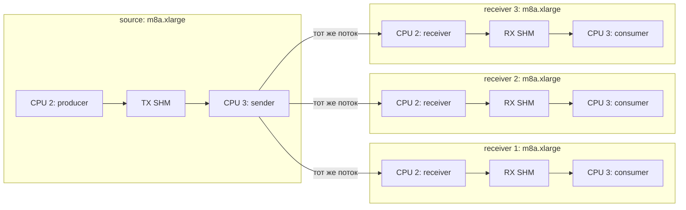

# AWS runner: топология и сборочный поток

Этот документ фиксирует целевую схему измерений. Она ориентирована только на
физический distributed fan-out и не пытается воспроизвести топологию agent
baseline. При необходимости чужой transport запускается на нашем стенде.

## 1. Целевая топология

Полный прогон использует четыре одинаковых benchmark-узла в `us-east-1`:

- один source `m8a.xlarge` с `producer` и `sender`;
- три отдельных receiver `m8a.xlarge`, на каждом своя пара `receiver` и
  `consumer`;
- один временный `t4g.nano` в роли NAT только для bootstrap и исходящего
  management-трафика.

Все benchmark-узлы находятся в одной Availability Zone и одной приватной
подсети. У них нет публичных IPv4 и открытых входящих management-портов. Доступ
выполняется через SSM Session Manager. Один приватный ENI на узел является
исходной конфигурацией; во время измерения SSM-сессии и загрузки должны быть
завершены, чтобы management-трафик не добавлял шум. Второй data ENI имеет смысл
проверять только отдельным экспериментом.



Fan-out выполняет один `sender`: каждый входной frame с тем же `seq_id` и
`send_ts_ns` уходит всем активным destinations. Каждый receiver и consumer
имеет независимую очередь и независимый файл результатов. Медленный или
потерявший пакет получатель не должен менять данные других получателей.

## 2. CPU и ядро

У `m8a.xlarge` четыре vCPU, соответствующие четырём физическим ядрам без SMT.
На каждом benchmark-узле разделение одинаково:

| CPU | Source | Receiver | Режим |
|---:|---|---|---|
| `0-1` | ОС, SSM, ENA IRQ | ОС, SSM, ENA IRQ | housekeeping |
| `2` | `producer` | `receiver` | isolated, pinned |
| `3` | `sender` | `consumer` | isolated, pinned |

Целевые kernel arguments:

```text
nohz_full=2-3
rcu_nocbs=2-3
irqaffinity=0-1
isolcpus=domain,managed_irq,2-3
```

Перед измерением проверяются `/proc/cmdline`, CPU affinity процессов,
`/proc/interrupts`, governor/frequency и отсутствие посторонней нагрузки на
CPU `2-3`. Четыре isolated core на узел не нужны: локально они требовались
потому, что все четыре hot-path процесса жили на одной машине.

### Правило измерения односторонней задержки

Основная метрика — прямая разность `receive_ts - send_ts` системных часов,
синхронизированных от ENA PHC. Её поправка всегда равна нулю, а рядом
сохраняется консервативная граница ошибки пары PHC.

`AWS_RUNNER_CLOCK_PROBE=1` дополнительно запускает двустороннюю UDP-пробу до и
после нагрузки. Её оценка сдвига и асимметрии — только диагностика: probe идёт
через kernel UDP по управляющему ENI, тогда как DPDK использует отдельный data
ENI. Поэтому результат probe сохраняется как `latency_corrected`, но никогда
не подменяет `latency_primary`. Даже малая текущая неопределённость probe не
делает два разных сетевых пути эквивалентными.

## 3. Quota, время жизни и стоимость

Полная схема занимает 18 Standard On-Demand vCPU:

```text
4 benchmark nodes * 4 vCPU + 1 NAT * 2 vCPU = 18 vCPU
```

Поданная заявка на 34 vCPU оставляет запас и достаточна для этой топологии.
Инстансы M8a недоступны в AWS Free Plan, поэтому перед запуском нужен переход
аккаунта на Paid Plan. AWS credits уменьшают итоговый платёж, пока применимы и
не исчерпаны, но не отменяют контроль расходов.

Один текущий прогон на миллионе сообщений при 200 тысячах сообщений в секунду
занимает около 5 секунд. Оплачивается и время bootstrap, пока EC2 запущены.
Поэтому бинарники собираются заранее, а не на benchmark-узлах. Целевой аварийный
TTL после перехода на пакетный bootstrap - 15 минут. Один абсолютный
`expires_at` управляет и EventBridge Scheduler, и локальным systemd timer на
всех четырёх benchmark-узлах и NAT. Относительные bootstrap-timers защищают
машины только до регистрации в SSM, после чего заменяются общим абсолютным
временем. Продление считается успешным только после нового успешного SSM
execution на всех пяти targets.

Штатная пауза останавливает все пять EC2, предварительно отключив Scheduler и
локальные timers. Compute в состоянии `stopped` не тарифицируется, но остаётся
оплата 104 GiB gp3 и небольшого объёма S3. После start EC2 может оказаться на
другом физическом host, поэтому сравниваемые варианты A/B лучше прогонять без
stop между ними. Полный destroy нужен в конце работы со стендом или при проверке
чистого развёртывания. Бюджет 10 USD и Lambda-рубильник остаются последней
линией защиты, потому что AWS Budgets не является real-time лимитом.

Практическое правило жизненного цикла стенда:

- во время активной разработки и серии тестов после каждой сессии выполняем
  `make aws-cluster-stop`; это прекращает оплату compute, но сохраняет диски и
  позволяет продолжить через `make aws-cluster-start` без повторного bootstrap;
- перед длительной паузой или после завершения экспериментов забираем нужные
  артефакты и выполняем `make aws-cluster-down`; это удаляет EC2, EBS, временный
  S3 bucket и прекращает расходы на хранение стенда.

Destroy также освобождает полученные экземпляры. Следующий cold-create снова
зависит от свободной On-Demand capacity `m8a.xlarge` именно в выбранной AZ и
может получить `Server.InsufficientInstanceCapacity`, даже если vCPU quota
достаточна. Строки уже завершённых EC2 некоторое время остаются видны в
консоли, но сами по себе capacity и quota не занимают. Для повторных рабочих
сессий поэтому используем stop/start, а не destroy/recreate. Если понадобится
гарантированный cold-create, отдельно добавляем выбор запасной AZ или Capacity
Reservation; это меняет условия сетевого стенда и не должно происходить скрыто.

## 4. Каноническая сборка

Рабочая станция может работать на Ubuntu 26.04, но релизный артефакт всегда
собирается в Ubuntu 24.04:

```text
Ubuntu 26.04 host
  -> Docker Ubuntu 24.04
  -> Clang 22 + libc++ для sender/receiver
  -> GCC из Ubuntu 24.04 для producer/consumer
  -> unit-тест harness
  -> nFPM
  -> spectral-task_<version>_amd64.deb
```

Docker проверяет пакет установкой в отдельный чистый Ubuntu 24.04 stage. Образ
Ubuntu закреплён по digest, nFPM - по версии и SHA-256. Итоговый каталог
`dist/` содержит только `.deb`; build-контейнеры и слои остаются в штатном
Docker cache.

Основная команда сборки с версией из Git commit:

```bash
make deb
```

Сборка с явной Debian-версией:

```bash
make deb DEB_VERSION=0.1.0-1
```

Make-цель вызывает `scripts/build-deb-ubuntu24.sh`; скрипт можно запускать
напрямую, когда Make недоступен.

Пакет устанавливает:

```text
/usr/libexec/spectral-task/bin/producer
/usr/libexec/spectral-task/bin/sender
/usr/libexec/spectral-task/bin/receiver
/usr/libexec/spectral-task/bin/consumer
/usr/libexec/spectral-task/lib/libc++.so.1
/usr/libexec/spectral-task/lib/libc++abi.so.1
/usr/share/doc/spectral-task/third-party/*.copyright
```

`libc++` и `libc++abi` находятся внутри пакета с локальным RUNPATH. На целевой
машине не нужен LLVM toolchain или репозиторий `apt.llvm.org`. Пакет зависит
только от штатных `libc6 (>= 2.39)`, `libgcc-s1` и `libstdc++6` Ubuntu 24.04.
Этот `.deb` намеренно не совместим с Ubuntu 20.04: для неё нужен отдельный
build-контейнер и отдельный пакет, собранный против её glibc.

## 5. Доставка и запуск в AWS

Целевой поток не выдаёт EC2 доступ к Git и не собирает исходники на стенде:

1. Локально собрать `.deb` скриптом выше.
2. Terraform загрузит пакет и его SHA-256 в приватный S3 bucket.
3. Instance role получит `s3:GetObject` только для этого объекта.
4. SSM `AWS-RunRemoteScript` скачает ровно этот объект, проверит SHA-256 и
   установит пакет через `dpkg --install`. `apt`, AWS CLI и compiler toolchain
   на benchmark-узлах не нужны.
5. Первая установка записывает kernel arguments и выполняет reboot. Обновление
   `.deb` на уже настроенном узле заканчивается после `dpkg --install`, без
   reboot и без замены EC2.
6. Перед source оркестратор требует явный `READY`: receiver уже сделал bind, а
   consumer активировал reader. Фиксированный `sleep` не является условием
   готовности; он используется только как backoff между SSM-опросами.
7. Процессы запускаются через `taskset` на CPU `2-3`. Маленькие summary logs и
   сжатый каталог с `latency.csv` SSM Agent записывает в `results/*` приватного
   bucket, после чего оркестратор скачивает их в
   `artifacts/aws-runner/<run-id>/`.

Cold create выполняется тремя Terraform-фазами, чтобы не было гонки с
регистрацией новых EC2 в SSM. Сначала создаются EC2 под защитой Scheduler и
локальных bootstrap-timers. После SSM-ready Terraform добавляет package
association; после его reboot и проверки CPU isolation Terraform добавляет TTL
association и заменяет `expires_at` на новое полное окно.

Приватная репа и GitHub-токен benchmark-узлам не нужны. Контейнер используется
только для сборки; сам benchmark работает нативно на Ubuntu 24.04 и видит
реальные kernel, scheduler и ENA.

Для SSM output permissions boundary разрешает `s3:PutObject` только в
`results/*` и `s3:GetEncryptionConfiguration` только для проектного bucket.
Эта версия boundary уже применена в аккаунте из `infra/bootstrap`; временный
root-профиль после apply разлогинен. Обычный пользователь выполняет весь
дальнейший цикл самостоятельно.

## 6. Сценарии эксплуатации

Граница ответственности намеренно такая:

- Terraform владеет ресурсами и их желаемым состоянием: сетью, IAM, S3, EC2,
  `running/stopped`, Scheduler, SSM Associations и общим TTL;
- AWS CLI используется как runtime control plane: запустить benchmark через
  SSM Run Command, дождаться готовности или завершения и скачать результаты;
- оркестратор не вызывает `ec2 start-instances`, `ec2 stop-instances` или
  `ssm start-associations-once` в обход Terraform.

Stop/start состоит из двух Terraform-фаз из-за зависимости от живого SSM
target. При stop сначала на работающих узлах отключаются Scheduler и локальные
timers, затем все EC2 переводятся в `stopped`. При start сначала EC2 переводятся
в `running` при всё ещё выключенном TTL, а после восстановления SSM создаётся
новый общий `expires_at`. Если процесс прервать между фазами, повтор той же
Make-команды продолжает переход из сохранённого Terraform state.

Первое создание кластера и проверка чистого bootstrap:

```bash
make aws-cluster-up
```

После `up` кластер уже запущен. Повторяемый рабочий цикл выглядит так:

```bash
make aws-cluster-run
make aws-cluster-update
make aws-cluster-run
make aws-cluster-stop
# в следующую сессию
make aws-cluster-start
make aws-cluster-run
make aws-cluster-stop
```

Перед каждым измерением процессы по умолчанию пропускают через полный путь две
секунды трафика, не записывая эти события в выборку. Время переводится в число
событий по заданной частоте, поэтому измерение начинается после однозначного
`seq_id`, а не после несинхронизированного `sleep` на другом узле. Параметры
сохраняются в manifest; длительность можно изменить, например:

```bash
make aws-cluster-run AWS_RUNNER_MESSAGE_RATE=2000000 \
  AWS_RUNNER_MESSAGE_COUNT=500000 AWS_RUNNER_WARMUP_MS=2000
```

Для DPDK оркестратор по умолчанию вычисляет минимальную целевую пачку как
`ceil(message_rate × receiver_count / 2M пакетов/с)`. Максимальный срок
ожидания остаётся явно заданным и равен `1200 нс`. При цели `1` эффективный
срок автоматически становится нулевым, поэтому низкая частота не получает
штрафа. Например, эта команда сама выберет цель `3`:

```bash
AWS_RUNNER_NETWORKING_BACKEND=dpdk \
  AWS_RUNNER_RECEIVER_COUNT=3 \
  AWS_RUNNER_MESSAGE_RATE=2000000 \
  make aws-cluster-run
```

Для воспроизводимого A/B цель, срок и PPS-бюджет можно переопределить через
`AWS_RUNNER_BATCH_TARGET_FRAMES`, `AWS_RUNNER_BATCH_WAIT_NS` и
`AWS_RUNNER_BATCH_PPS_BUDGET`. Запрошенные и фактически применённые значения,
а также способ выбора цели сохраняются в `manifest.json`; это детерминированная
конфигурация из заранее известной нагрузки, а не скрытая runtime-эвристика.
Автоматический профиль сокетного бэкенда всегда выбирает цель `1`: измеренное
ожидание пачки для kernel UDP ухудшало хвост.

`aws-cluster-run` в начале синхронно продлевает общий TTL. Отдельное продление:

```bash
make aws-cluster-extend AWS_RUNNER_TTL_MINUTES=15
```

Проверка состояния и окончательное удаление:

```bash
make aws-cluster-fetch
# или: make aws-cluster-fetch AWS_RUNNER_RUN_ID=unicast-YYYYMMDDTHHMMSSZ
make aws-cluster-status
make aws-cluster-audit
make aws-cluster-down
```

`aws-cluster-run` сразу скачивает созданный run. Отдельный `aws-cluster-fetch`
идемпотентно повторяет загрузку последнего run или указанного
`AWS_RUNNER_RUN_ID`, в том числе когда EC2 уже остановлены, но S3 bucket ещё
сохранён Terraform.

По умолчанию Terraform показывает план и запрашивает подтверждение. Для
неинтерактивного локального запуска можно явно добавить
`AWS_RUNNER_AUTO_APPROVE=1`. Путь к пакету определяется автоматически, если в
`dist/` находится ровно один `.deb`; иначе передаётся
`AWS_RUNNER_PACKAGE=/absolute/path/package.deb`.

Полная проверка чистого создания, benchmark, выгрузки при stopped-кластере и
повторного start/stop запускается одной штатной целью:

```bash
make aws-cluster-e2e AWS_RUNNER_AUTO_APPROVE=1
```

Она заканчивает работу со всеми EC2 в `stopped` и сохраняет длительности фаз в
`artifacts/aws-runner/e2e-<UTC>/timings.tsv`. Makefile остаётся публичным CLI;
реализация сценариев находится в `infra/runner/scripts/cluster.sh`, а прямые
AWS CLI команды нужны только внутри него и для нештатной диагностики.

После E2E актуальные публичные On-Demand цены и экономия времени рассчитываются
детерминированно по сохранённым таймингам:

```bash
make aws-cluster-cost
```

## 7. Проверенный сценарий

Инфраструктурный unicast-прогон на двух из четырёх `m8a.xlarge` подтвердил:

- приватные узлы без public IPv4 доступны через SSM;
- пакет ставится из точного S3 object без `apt`;
- CPU `2-3` изолированы и процессы действительно pinned;
- после явного READY-handshake прошли `1,000,000 / 1,000,000` сообщений без
  send errors, UDP drops, SHM drops и lapping;
- `terraform destroy` удалил state и не оставил живых EC2/EBS с проектным
  тегом.

Измеренные latency одного диагностического прогона не считаются итоговым
performance-результатом: для него нужны повторения и полный fan-out.

## 8. Что ещё нужно реализовать

Terraform runner уже использует `m8a.xlarge`, CPU `2-3`, TTL 15 минут и готовый
`.deb`. Для полного прогона остаётся:

- научить текущий `sender`, который пока принимает один `--dest`, работать с
  тремя независимыми destinations;
- добавить оркестрацию полного `1 -> 3` запуска и выгрузку трёх результатов.
